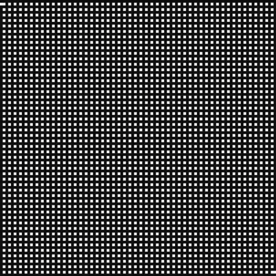
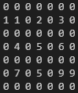
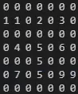
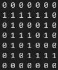

# Maze generator and solver

Here is my Maze generator and solver.  
The file contains 2 classes: 
- 1 Maze that can be printed in the terminal, I use it just to get the maze's data.  
- the same but displayed with the built-in tkinter library.  

They can have differents Width and Height.  

## 🧠 Algorithms

### Generation

we first generate a grid of 0 for the walls and a different int for each holes. So the dimensions of the labyrinth must be odd.  
Then we break the entrance and the exit. 

Then we pick a wall randomly and check if the two cells next to it have a different number.  
If this is the case, we unify the cells by giving them the smallest number.  
Using this technique the numbers of ways and walls are fixed by:  
- walls: 0.5(Width*Height +Width +Height) -1.5  
- ways:  0.5(Width*Height -Width -Height) +1.5 

we just have to count the number of ways at the beginning and add 1 each time we break a wall.  
Our maze is done when the number of counted ways is equal tu the equation above.  

### Resolving

We test the start, we set its value to 2.  
the right, bottom, top and left cells are tested in this order.  
once all the adjacent cells are tested, the cell is not in the path, it is reset to 1.  
as soon as a square arrives at the finish we go up the path (in the graphic version we put these cells in green).  
With this proceed we don't find the shortest path each times but it is not a problem since our maze have only 1 path.  

